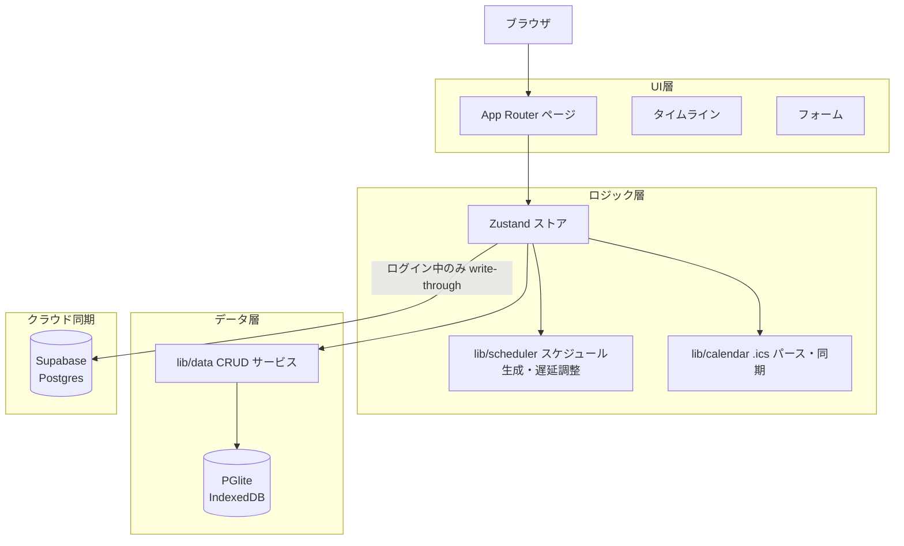

# ⏱ TimeKeeper

[](https://nextjs.org/)
[](https://react.dev/)
[](https://www.typescriptlang.org/)
[](https://supabase.com/)
[](./docker-compose.yml)
[](https://opensource.org/licenses/MIT)

> **生活習慣パターンとカレンダーを統合し、移動時間を考慮した最適な1日のスケジュールを自動生成する Web アプリ**

🔗 **ライブデモ**: [https://timekeeper.frural.jp](https://timekeeper.frural.jp)

---

| ホーム・タイムライン | パターン管理 |
|:---:|:---:|
|  |  |

| 場所・移動時間 | カレンダー連携 |
|:---:|:---:|
|  |  |

---

## 📖 概要

TimeKeeper は、毎日の生活習慣（ルーティン）をパターンとして登録し、Apple Calendar・Google Calendar などの `.ics` ファイルと組み合わせることで、**移動時間込みの現実的な1日のスケジュール**を自動生成します。すべてのデータはブラウザ内（IndexedDB）に保存され、サーバー不要でオフライン動作します。

### なぜ作ったのか

- 毎朝「今日何時に出発すればいい？」を考えるのが面倒だった
- カレンダーには予定があっても、移動時間や習慣が抜けて現実のスケジュールとズレる
- 遅延が発生したとき、後続の予定を手動で調整するのが煩わしかった

---

## ✨ 主な機能

- **生活習慣パターン管理**: 平日・休日などの複数パターンを登録し、曜日・キーワードで自動切り替え
- **カレンダー連携**: `.ics` ファイルのインポート・差分同期 / Google カレンダー iCal 同期
- **移動時間の自動挿入**: 場所が変わるイベント間に移動時間を自動で挿入
- **スケジュール自動生成**: ルーティン・カレンダー・移動時間を統合して1日のスケジュールを生成
- **リアルタイムタイムライン**: 現在・次のイベントをリアルタイム表示、遅延を検出して後続を自動調整
- **オフライン永続化**: PGlite（ブラウザ内 PostgreSQL）で IndexedDB に保存。サーバー不要

---

## 🛠 技術スタック

| カテゴリ | 技術 |
|:--|:--|
| フレームワーク | Next.js 16 (App Router), React 19 |
| 言語 | TypeScript 5 |
| スタイリング | TailwindCSS v4, shadcn/ui (Radix UI) |
| 状態管理 | Zustand 5 |
| フォーム・バリデーション | React Hook Form + Zod v4 |
| データベース | PGlite v0.3（IndexedDB 上のブラウザ内 PostgreSQL） |
| 認証・同期 | Supabase Auth（Magic Link）+ クロスデバイス同期 |
| 日付処理 | date-fns v4 |
| テスト | Vitest + Testing Library |
| 開発ツール | ESLint, Prettier, Husky |
| インフラ | Vercel（デプロイ）, Docker（開発環境） |

---

## 🏗 アーキテクチャ



---

## 🚀 はじめ方

### 前提条件

- **Docker 推奨**（Node.js 22・pnpm 不要）
- または Node.js 20以上 + pnpm 9以上

### Docker で起動（推奨）

```bash
# リポジトリをクローン
git clone https://github.com/ryusei2790/timekeeper.git
cd timekeeper

# 環境変数を設定（Supabase を使う場合）
cp .env.example .env.local
# .env.local を編集して Supabase の URL / ANON_KEY を入力

# 起動（初回は image build で数分かかります）
docker compose up
```

[http://localhost:3000](http://localhost:3000) でアプリが起動します。

> ファイルを編集するとブラウザが自動更新されます（ホットリロード対応）。

### ローカルで起動

```bash
git clone https://github.com/ryusei2790/timekeeper.git
cd timekeeper

pnpm install

cp .env.example .env.local
# .env.local を編集

pnpm dev
```

### 環境変数

`.env.example` をコピーして `.env.local` を作成し、値を設定してください。

| 変数名 | 説明 |
|:--|:--|
| `NEXT_PUBLIC_SUPABASE_URL` | Supabase プロジェクトの URL |
| `NEXT_PUBLIC_SUPABASE_ANON_KEY` | Supabase の anon キー |

> Supabase を使わない場合（ローカルのみで使う）は `.env.local` の作成を省略できます。

---

## 🖥 画面構成

| 画面 | URL | 説明 |
|:--|:--|:--|
| ホーム | `/` | 今日のスケジュール・タイムライン・イベント操作 |
| パターン管理 | `/patterns` | 生活習慣パターンとルーティン項目の CRUD |
| 場所・移動 | `/places` | 場所と移動ルートの CRUD |
| カレンダー | `/calendar` | .ics ファイルのインポート・Google カレンダー iCal 同期 |
| 設定 | `/settings` | 一般設定・データのエクスポート/インポート/削除 |

---

## 📅 Google カレンダー連携

### iCal 同期

Google カレンダーの iCal URL を設定画面に貼り付けるだけで同期できます。

**限定公開 URL の取得手順:**

1. [Google カレンダー](https://calendar.google.com) を開く
2. 同期したいカレンダーの「⋮」→「設定と共有」をクリック
3. 「他のカレンダーとの統合」→「**非公開の iCal 形式 URL**」をコピー
4. TimeKeeper の設定ページに貼り付けて保存

> 限定公開 URL は第三者に共有しないでください。

---

## 🗺 ロードマップ

| フェーズ | 内容 | 状態 |
|:--|:--|:--|
| Phase 1〜4 | データ層・コアロジック・基本UI・タイムライン | ✅ 完了 |
| Phase 5a | カレンダー連携（.ics インポート） | ✅ 完了 |
| Phase 6 | Supabase Auth + クロスデバイス同期 + Vercel デプロイ | 🔄 実装中 |
| Phase 5b | Google Calendar OAuth リアルタイム同期 | ⬜ 予定 |
| v2 | PWA・プッシュ通知・ダークモード | ⬜ 予定 |

---

## 🔧 開発コマンド

```bash
pnpm dev          # 開発サーバー起動 (http://localhost:3000)
pnpm build        # プロダクションビルド
pnpm lint         # ESLint 実行
pnpm format       # Prettier フォーマット
pnpm type-check   # TypeScript 型チェック
pnpm test         # Vitest テスト実行
```

---

## 📄 ライセンス

このプロジェクトは [MIT License](LICENSE) の下で公開されています。
