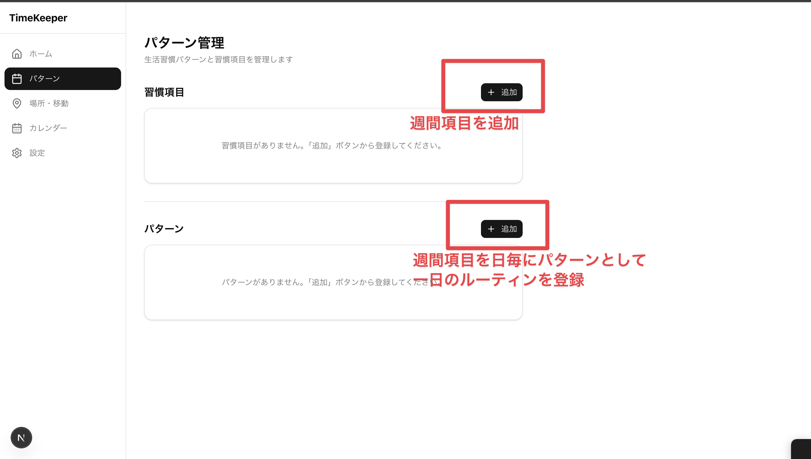
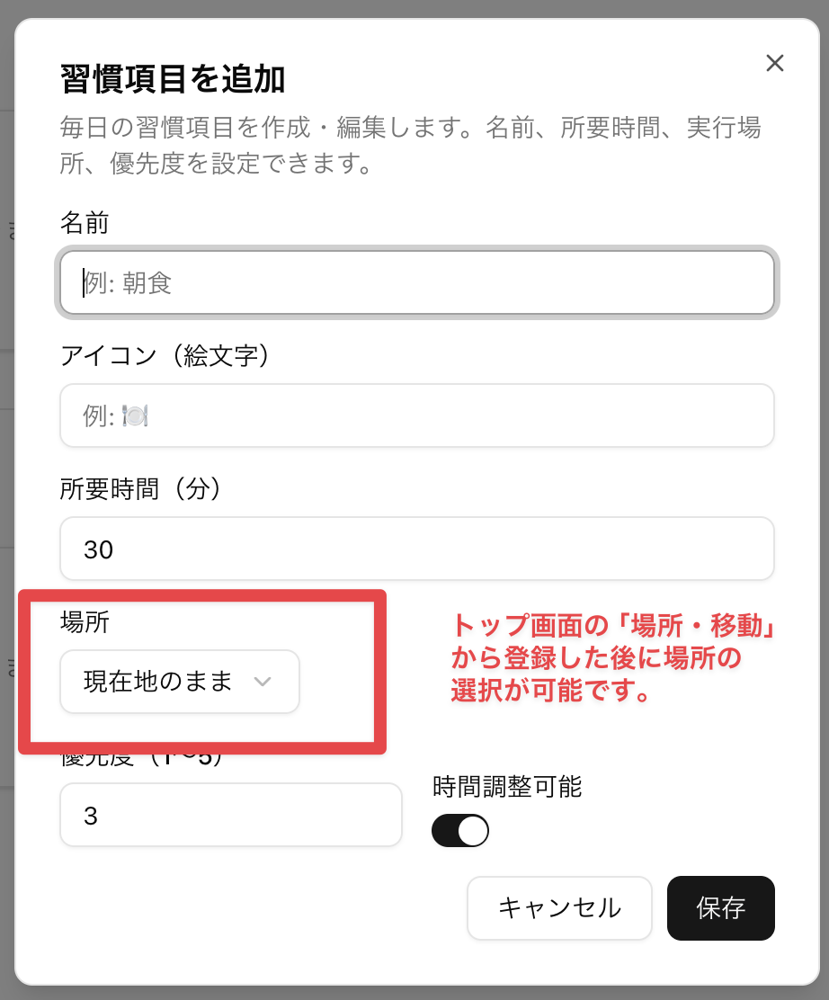
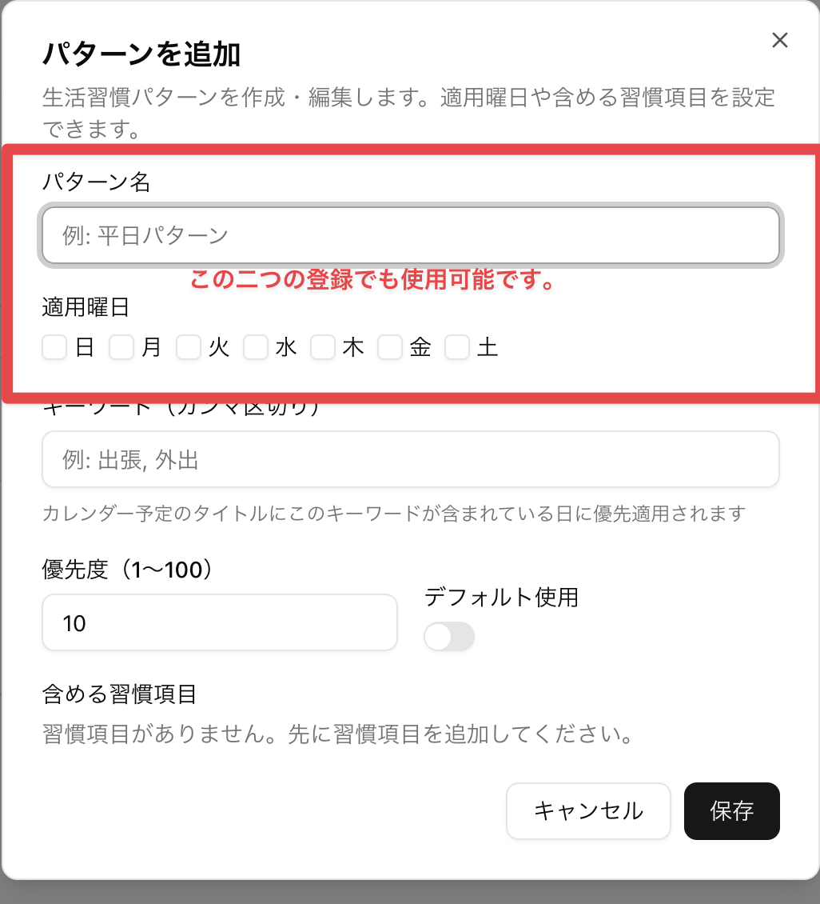
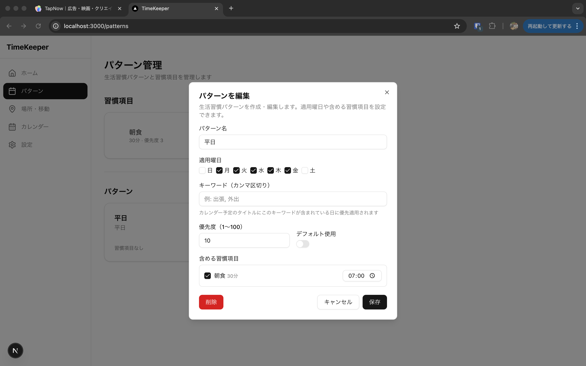
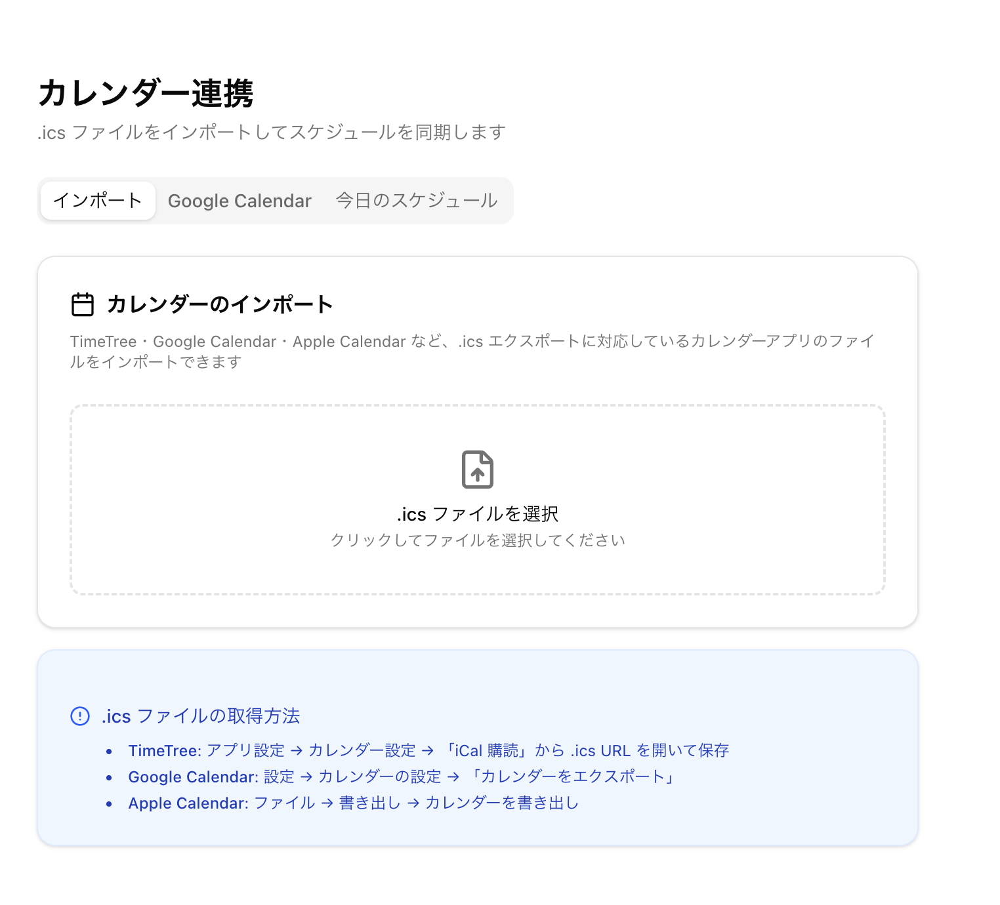
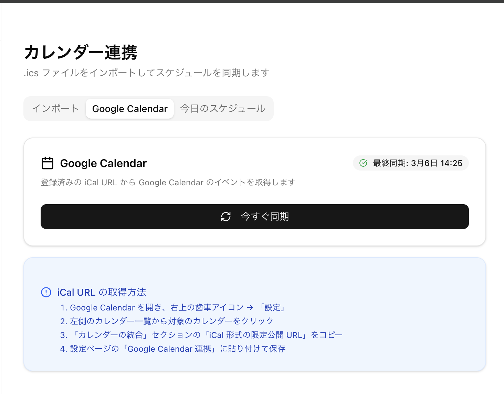
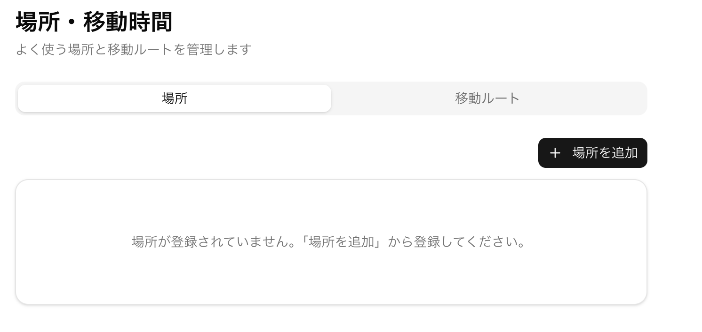
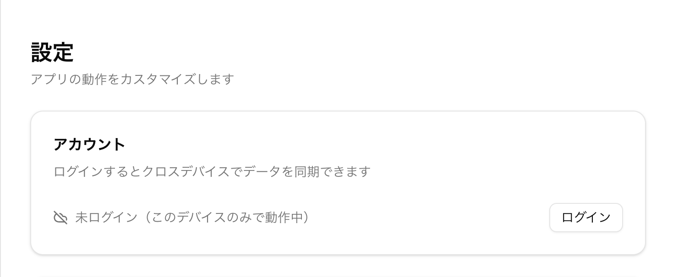

# 「今日、何するんだっけ？」をなくすアプリをリリースしました

---

## ルーティンって、なぜ続かないんだろう

「毎朝6時に起きて、ストレッチして、英語の勉強してから出勤する」

そう決めたのに、気づいたら8時半にスマホを眺めながらベッドにいる——そんな経験、ありませんか？

ルーティンが続かない理由のひとつは、**「次に何をすればいいか」が頭の中でぼんやりしているから**だと思っています。

「たしか朝にやること、いくつか決めてたよな…何だっけ？」
「あれ、今から何分あれば間に合う？」
「移動があるから逆算すると…」

毎朝、こういう計算を頭の中でやりながら一日がスタートする。それだけで脳が疲れて、ルーティンより「とりあえずSNS」になっていく。

そこで作ったのが **TimeKeeper** です。

---

## TimeKeeper とは

**生活習慣パターンとカレンダーを統合して、今日のスケジュールを自動で組んでくれるWebアプリ**です。

朝アプリを開けば、「7:00 起床 → 7:15 ストレッチ（15分）→ 7:30 朝食（30分）→ 8:30 移動（電車・35分）→ 9:05 出勤」のような今日のタイムラインが並んでいます。

考えなくていい。ただ、次のアクションを見て動くだけ。

---

## こんな人に使ってほしい

- **「ルーティン、何個か決めてたはずなのに全部思い出せない」**
- **「やりたいことはあるけど、時間が足りない感じがする」**
- **「予定と習慣が混在して、今日何をすべきか毎朝考えるのが面倒」**
- **「移動時間を毎回計算するのが地味につらい」**

---

## 主な機能

### 1. 習慣パターンを登録する

「平日パターン」「休日パターン」「リモートワーク日パターン」など、自分のライフスタイルに合わせた複数のパターンを作れます。

それぞれのパターンに「起床 6:30」「朝食 7:00（30分）」「英語勉強 7:30（20分）」…といった習慣を時刻付きで並べておくだけ。

*習慣項目とパターンをそれぞれ「追加」ボタンから登録できます。*

習慣項目には名前・所要時間・場所・優先度を設定できます。

パターンには適用曜日を設定でき、曜日によって自動で使うパターンを切り替えられます。

各習慣の開始時刻を割り当てれば、一日のルーティンが完成します。

---

### 2. カレンダーと統合する

.ics ファイル（Apple Calendar・Google Calendar・TimeTree などからエクスポートできる形式）をインポートすると、**その日の予定と習慣が自動でマージ**されます。

「10時から会議がある日は、朝のルーティンを何時までに終わらせればいい？」——自分で計算しなくても、タイムラインが自動で組まれます。

*TimeTree・Google Calendar・Apple Calendar などの .ics ファイルをドラッグ＆ドロップでインポートできます。*

#### Google Calendar と直接連携する

iCal URL を登録しておくと、毎回ファイルをエクスポートしなくても「今すぐ同期」ボタン一発でカレンダーを取得できます。

**iCal URL の取得方法：**

1. Google Calendar の設定を開き、対象のカレンダーの「カレンダーの統合」セクションへ

*「埋め込みコード」内の `<iframe src="..."` の URL（`https://calendar.google.com/calendar/embed?...`）をコピーします。*

2. TimeKeeper の設定画面「Google Calendar 連携」に貼り付けて保存

3. カレンダーページの「Google Calendar」タブから予定を確認・同期できます

---

### 3. 移動時間を自動で挿入する

「自宅→駅（徒歩8分）」「駅→会社（電車27分）」のような移動ルートをあらかじめ登録しておくと、場所が変わるイベントの間に**移動時間が自動挿入**されます。

「移動を考えたら、何時に家を出ればいい？」の答えが勝手に出ます。

*「場所」タブで自宅・会社・ジムなどを登録し、「移動ルート」タブで区間と所要時間を設定します。*

---

### 4. 今日のタイムラインをリアルタイムで追う

ホーム画面には今日のスケジュールがタイムライン形式で表示されます。

- **今やっていること**（現在のイベント）
- **次にやること**（次のイベントと残り時間）
- 完了チェックを入れると、次のイベントへ

---

## 使い方：セットアップから日常利用まで

### 初期設定（一度だけ・10分ほど）

**Step 1: 場所を登録する**
「自宅」「会社」「ジム」など、よく行く場所を登録します。

**Step 2: 移動ルートを登録する**
「自宅 → 会社：電車35分」「自宅 → ジム：徒歩12分」のように、区間と所要時間を入力します。

**Step 3: 習慣項目を作る**
「朝食（30分）」「ストレッチ（15分）」「英語勉強（20分）」など、やりたい習慣を名前と所要時間で登録します。

**Step 4: パターンを組む**
「平日パターン」に各習慣の開始時刻を割り当てます。「起床 6:30」「ストレッチ 6:40」「朝食 7:00」…という感じです。

---

### 毎日の使い方（朝1〜2分）

1. アプリを開く
2. 今日のスケジュールを確認（自動生成済み）
3. あとは順番にこなすだけ
4. 予定が入っている日は .ics をインポートすると統合される

---

## データはブラウザに保存される

TimeKeeper はブラウザ内のデータベース（PGlite）でデータを管理するため、**インターネット接続なしでも動作**します。

アカウント登録で複数デバイス間のデータ同期も可能（現在実装中・近日公開）。

---

## さいごに

「ルーティンを守れない自分がダメ」じゃなくて、「仕組みがなかっただけ」だと思っています。

毎朝「次は何をすればいいか」を考えなくていい状態を作るのが、TimeKeeper の目指すところです。

ぜひ試してみてください。

**→ [TimeKeeper を使ってみる](#)**（URLは公開後に更新予定）

---

*フィードバックや感想は X（旧Twitter）の [@your_handle](#) まで。開発の励みになります。*
