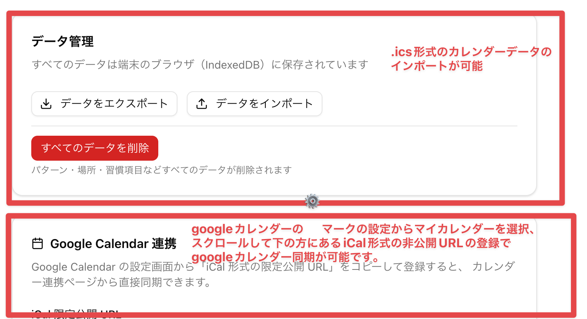

# TimeKeeper 使用方法

TimeKeeper は、生活習慣パターンとカレンダーを統合し、移動時間を考慮した最適な1日のスケジュールを自動生成するアプリです。

---

## セットアップ手順

初めて使用する際は、以下の順序で設定することを推奨します。

1. **場所を登録する**（場所・移動ページ）
2. **習慣項目を登録する**（パターンページ）
3. **パターンを作成する**（パターンページ）

---

## ステップ 1: 場所を登録する

ナビゲーションから「場所・移動」を開きます。

「**場所を追加**」ボタンをクリックして、よく使う場所（自宅、職場など）を登録します。場所を登録しておくと、習慣項目ごとに実行場所を設定したり、スケジュール生成時に移動時間を自動計算できます。

> 場所を 2 つ以上登録すると、「移動ルート」タブから移動ルート（手段・所要時間）を追加できます。

---

## ステップ 2: 習慣項目を登録する

ナビゲーションから「パターン」を開きます。

「習慣項目」セクションの「**追加**」ボタンをクリックして、毎日の習慣（朝食、運動、読書など）を登録します。

| 項目               | 説明                                                     |
| ------------------ | -------------------------------------------------------- |
| 名前               | 習慣の名前（例: 朝食）                                   |
| アイコン（絵文字） | 表示用の絵文字（例: 🍳）                                 |
| 所要時間（分）     | この習慣にかかる時間                                     |
| 場所               | 実行場所（ステップ 1 で登録した場所から選択）            |
| 優先度（1〜5）     | スケジュール調整時の優先度                               |
| 時間調整可能       | オンにするとスケジュール生成時に時間を柔軟に調整できます |

> **注意:** 場所の選択肢は「場所・移動」ページで登録した後に表示されます。先に場所を登録しておきましょう。

---

## ステップ 3: パターンを作成する

「パターン」セクションの「**追加**」ボタンをクリックして、曜日ごとのルーティンパターンを作成します。

| 項目             | 説明                                                           |
| ---------------- | -------------------------------------------------------------- |
| パターン名       | パターンの名前（例: 平日パターン）                             |
| 適用曜日         | このパターンを適用する曜日（複数選択可）                       |
| キーワード       | カレンダー予定のタイトルにこのキーワードが含まれる日に優先適用 |
| 優先度（1〜100） | 複数パターンが一致した場合の優先順位                           |
| デフォルト使用   | オンにするとどの条件にも合わない日に自動適用                   |

> **ポイント:** パターン名と適用曜日の 2 つだけ設定すれば使い始めることができます。

パターン作成後は「編集」から習慣項目を追加し、各項目の開始時刻を設定します。

「含める習慣項目」セクションで使いたい習慣項目にチェックを入れ、右側の時刻フィールドで開始時刻を指定します。

---

## カレンダー連携

### .ics ファイルをインポートする

ナビゲーションから「カレンダー」を開き、「**インポート**」タブを選択します。

ファイル選択エリアをクリックして `.ics` ファイルを選択すると、カレンダーのイベントが取り込まれます。

**.ics ファイルの取得方法:**

- **TimeTree:** アプリ設定 → カレンダー設定 → 「iCal 購読」から .ics URL を開いて保存
- **Google Calendar:** 設定 → カレンダーの設定 → 「カレンダーをエクスポート」
- **Apple Calendar:** ファイル → 書き出し → カレンダーを書き出し

---

### Google Calendar と同期する

「**Google Calendar**」タブでは、iCal URL を登録することで直接同期できます。

iCal URL を設定済みの場合、「**今すぐ同期**」ボタンをクリックすると最新のイベントを取得できます。最終同期日時も確認できます。

**iCal URL の取得方法:**

1. Google Calendar を開き、右上の歯車アイコン → 「設定」
2. 左側のカレンダー一覧から対象のカレンダーをクリック
3. 「カレンダーの統合」セクションの「iCal 形式の限定公開 URL」をコピー
4. 設定ページの「Google Calendar 連携」に貼り付けて保存

> iCal URL の登録は「**設定**」ページの「Google Calendar 連携」セクションからも行えます。

---

## アカウントとデータ管理

### ログインとクロスデバイス同期

ナビゲーションから「設定」を開きます。

未ログイン状態ではデータはこのデバイスのブラウザ（IndexedDB）にのみ保存されます。「**ログイン**」ボタンからメールアドレスでサインインすると、複数デバイス間でデータを同期できます（Magic Link 認証）。

### データのエクスポート・インポート

設定ページの「**データ管理**」セクションでデータのバックアップと復元ができます。

- **データをエクスポート:** すべてのデータを JSON 形式でダウンロード
- **データをインポート:** エクスポートした JSON ファイルを読み込んでデータを復元
- **すべてのデータを削除:** パターン・場所・習慣項目などすべてのデータを削除（確認ダイアログあり）

---

## ホーム画面の使い方

設定が完了したら、ナビゲーションの「ホーム」を開きます。

- 上部のドロップダウンから今日適用したいパターンを選択します
- 「**再生成**」ボタンをクリックすると、選択パターンとカレンダーのイベントを組み合わせてスケジュールを自動生成します
- **現在のイベントカード** には実行中のイベントが表示され、「完了」または「スキップ」で進捗を記録できます
- **次のイベントカード** には次に実行するイベントが表示されます
- **今日のスケジュール** タイムラインで1日の流れを一覧確認できます
